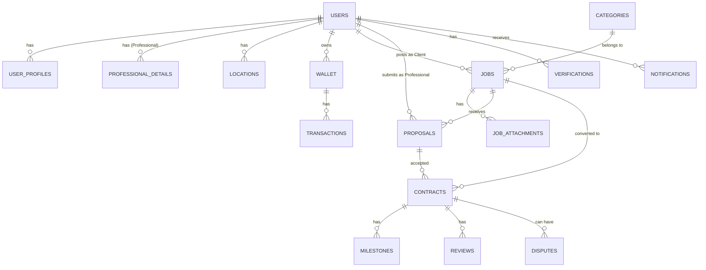

# Phase-1 Database Design

This is the database reference for the Skill Shine Gateway Phase-1 scope.

## ER Diagram

## Tables

### 1. users

| Column            | Type         | Constraints                         | Description        |
| ----------------- | ------------ | ----------------------------------- | ------------------ |
| id                | UUID         | PRIMARY KEY                         | Unique user ID     |
| role              | VARCHAR(20)  | NOT NULL, client/professional/admin | User role          |
| email             | VARCHAR(255) | UNIQUE                              | Email              |
| phone             | VARCHAR(20)  | UNIQUE                              | Phone number       |
| password_hash     | TEXT         | -                                   | Hashed password    |
| google_id         | VARCHAR(100) | UNIQUE                              | Google OAuth ID    |
| is_email_verified | BOOLEAN      | DEFAULT false                       | Email verification |
| is_phone_verified | BOOLEAN      | DEFAULT false                       | Phone verification |
| status            | VARCHAR(20)  | DEFAULT active                      | active/suspended   |
| created_at        | TIMESTAMP    | DEFAULT CURRENT_TIMESTAMP           | Created time       |
| updated_at        | TIMESTAMP    | DEFAULT CURRENT_TIMESTAMP           | Updated time       |
| last_login        | TIMESTAMP    | -                                   | Last login         |

### 2. user_profiles

| Column        | Type         | Constraints               | Description         |
| ------------- | ------------ | ------------------------- | ------------------- |
| user_id       | UUID         | PRIMARY KEY, FK users(id) | Link to user        |
| full_name     | VARCHAR(100) | -                         | Full name           |
| company_name  | VARCHAR(100) | NULL                      | Company name        |
| profile_photo | TEXT         | -                         | Profile picture URL |
| address       | TEXT         | -                         | Private address     |
| bio           | TEXT         | -                         | About user          |
| timezone      | VARCHAR(50)  | -                         | Timezone            |
| language      | VARCHAR(10)  | -                         | Language            |

### 3. professional_details

| Column              | Type          | Constraints               | Description       |
| ------------------- | ------------- | ------------------------- | ----------------- |
| user_id             | UUID          | PRIMARY KEY, FK users(id) | Professional user |
| hourly_rate         | DECIMAL(10,2) | -                         | Hourly rate       |
| fixed_rate          | DECIMAL(10,2) | -                         | Fixed rate        |
| experience_years    | INTEGER       | -                         | Experience        |
| skills              | JSONB         | -                         | Skills array      |
| service_type        | VARCHAR(20)   | onsite/remote/both        | Service mode      |
| service_radius_km   | INTEGER       | -                         | Service radius    |
| availability_status | VARCHAR(20)   | -                         | available/busy    |
| portfolio_url       | TEXT          | -                         | Portfolio         |
| is_verified         | BOOLEAN       | DEFAULT false             | Overall verified  |

### 4. locations

| Column            | Type          | Constraints   | Description             |
| ----------------- | ------------- | ------------- | ----------------------- |
| id                | UUID          | PRIMARY KEY   | Location ID             |
| user_id           | UUID          | FK users(id)  | User ID                 |
| lat               | DECIMAL(10,8) | -             | Latitude                |
| lng               | DECIMAL(11,8) | -             | Longitude               |
| city              | VARCHAR(100)  | -             | City                    |
| state             | VARCHAR(100)  | -             | State                   |
| country           | VARCHAR(100)  | -             | Country                 |
| address_approx    | TEXT          | -             | Public approximate area |
| service_radius_km | INTEGER       | -             | Radius                  |
| is_base_location  | BOOLEAN       | DEFAULT false | Base location           |

### 5. categories

| Column      | Type         | Constraints       | Description     |
| ----------- | ------------ | ----------------- | --------------- |
| id          | SERIAL       | PRIMARY KEY       | Category ID     |
| name        | VARCHAR(100) | NOT NULL          | Name            |
| slug        | VARCHAR(100) | UNIQUE            | Slug            |
| parent_id   | INTEGER      | FK categories(id) | Parent category |
| icon        | TEXT         | -                 | Icon            |
| description | TEXT         | -                 | Description     |
| is_active   | BOOLEAN      | DEFAULT true      | Active          |

### 6. jobs

| Column      | Type          | Constraints               | Description    |
| ----------- | ------------- | ------------------------- | -------------- |
| id          | UUID          | PRIMARY KEY               | Job ID         |
| client_id   | UUID          | FK users(id)              | Client         |
| category_id | INTEGER       | FK categories(id)         | Category       |
| title       | VARCHAR(255)  | NOT NULL                  | Title          |
| description | TEXT          | -                         | Description    |
| budget_min  | DECIMAL(12,2) | -                         | Minimum budget |
| budget_max  | DECIMAL(12,2) | -                         | Maximum budget |
| currency    | VARCHAR(3)    | DEFAULT INR               | Currency       |
| job_type    | VARCHAR(20)   | onsite/remote/both        | Job type       |
| lat         | DECIMAL(10,8) | -                         | Latitude       |
| lng         | DECIMAL(11,8) | -                         | Longitude      |
| city        | VARCHAR(100)  | -                         | City           |
| job_date    | DATE          | -                         | Job date       |
| deadline    | DATE          | -                         | Deadline       |
| urgency     | VARCHAR(20)   | low/medium/high/urgent    | Urgency        |
| status      | VARCHAR(30)   | DEFAULT draft             | Status         |
| created_at  | TIMESTAMP     | DEFAULT CURRENT_TIMESTAMP | Created time   |

### 7. job_attachments

| Column      | Type        | Constraints    | Description   |
| ----------- | ----------- | -------------- | ------------- |
| id          | UUID        | PRIMARY KEY    | Attachment ID |
| job_id      | UUID        | FK jobs(id)    | Job           |
| file_url    | TEXT        | -              | File URL      |
| file_type   | VARCHAR(20) | photo/document | File type     |
| uploaded_by | UUID        | FK users(id)   | Uploaded by   |

### 8. proposals

| Column          | Type          | Constraints               | Description  |
| --------------- | ------------- | ------------------------- | ------------ |
| id              | UUID          | PRIMARY KEY               | Proposal ID  |
| job_id          | UUID          | FK jobs(id)               | Job          |
| professional_id | UUID          | FK users(id)              | Professional |
| quoted_price    | DECIMAL(12,2) | -                         | Quoted price |
| timeline_days   | INTEGER       | -                         | Timeline     |
| cover_message   | TEXT          | -                         | Message      |
| status          | VARCHAR(30)   | DEFAULT pending           | Status       |
| proposed_at     | TIMESTAMP     | DEFAULT CURRENT_TIMESTAMP | Time         |

### 9. contracts

| Column          | Type          | Constraints               | Description  |
| --------------- | ------------- | ------------------------- | ------------ |
| id              | UUID          | PRIMARY KEY               | Contract ID  |
| job_id          | UUID          | FK jobs(id)               | Job          |
| client_id       | UUID          | FK users(id)              | Client       |
| professional_id | UUID          | FK users(id)              | Professional |
| proposal_id     | UUID          | FK proposals(id)          | Proposal     |
| total_amount    | DECIMAL(12,2) | -                         | Total amount |
| platform_fee    | DECIMAL(12,2) | -                         | Commission   |
| status          | VARCHAR(30)   | -                         | Status       |
| start_date      | DATE          | -                         | Start date   |
| end_date        | DATE          | -                         | End date     |
| created_at      | TIMESTAMP     | DEFAULT CURRENT_TIMESTAMP | Created time |

### 10. milestones

| Column          | Type          | Constraints      | Description  |
| --------------- | ------------- | ---------------- | ------------ |
| id              | UUID          | PRIMARY KEY      | Milestone ID |
| contract_id     | UUID          | FK contracts(id) | Contract     |
| title           | VARCHAR(200)  | -                | Title        |
| amount          | DECIMAL(10,2) | -                | Amount       |
| due_date        | DATE          | -                | Due date     |
| status          | VARCHAR(30)   | DEFAULT pending  | Status       |
| completed_proof | TEXT          | -                | Proof URL    |

### 11. reviews

| Column      | Type        | Constraints                 | Description   |
| ----------- | ----------- | --------------------------- | ------------- |
| id          | UUID        | PRIMARY KEY                 | Review ID     |
| contract_id | UUID        | FK contracts(id)            | Contract      |
| reviewer_id | UUID        | FK users(id)                | Reviewer      |
| reviewed_id | UUID        | FK users(id)                | Reviewed user |
| rating      | INTEGER     | CHECK 1-5                   | Rating        |
| review_text | TEXT        | -                           | Review        |
| review_type | VARCHAR(30) | client_to_pro/pro_to_client | Type          |
| created_at  | TIMESTAMP   | DEFAULT CURRENT_TIMESTAMP   | Time          |

### 12. verifications

| Column          | Type        | Constraints               | Description       |
| --------------- | ----------- | ------------------------- | ----------------- |
| id              | UUID        | PRIMARY KEY               | Verification ID   |
| professional_id | UUID        | FK users(id)              | Professional      |
| document_type   | VARCHAR(50) | -                         | ID, license, etc. |
| document_url    | TEXT        | -                         | Document URL      |
| status          | VARCHAR(20) | pending/approved/rejected | Status            |
| reviewed_by     | UUID        | FK users(id)              | Admin             |
| reviewed_at     | TIMESTAMP   | -                         | Review time       |
| notes           | TEXT        | -                         | Notes             |

### 13. disputes

| Column      | Type        | Constraints      | Description |
| ----------- | ----------- | ---------------- | ----------- |
| id          | UUID        | PRIMARY KEY      | Dispute ID  |
| contract_id | UUID        | FK contracts(id) | Contract    |
| raised_by   | UUID        | FK users(id)     | Raised by   |
| reason      | TEXT        | -                | Reason      |
| description | TEXT        | -                | Details     |
| status      | VARCHAR(30) | DEFAULT open     | Status      |
| resolution  | TEXT        | -                | Resolution  |

### 14. saved_jobs

| Column     | Type      | Constraints               | Description  |
| ---------- | --------- | ------------------------- | ------------ |
| user_id    | UUID      | FK users(id)              | Professional |
| job_id     | UUID      | FK jobs(id)               | Job          |
| created_at | TIMESTAMP | DEFAULT CURRENT_TIMESTAMP | Saved time   |

### 15. shortlisted_professionals

| Column          | Type      | Constraints               | Description  |
| --------------- | --------- | ------------------------- | ------------ |
| client_id       | UUID      | FK users(id)              | Client       |
| professional_id | UUID      | FK users(id)              | Professional |
| created_at      | TIMESTAMP | DEFAULT CURRENT_TIMESTAMP | Time         |

### 16. wallet

| Column   | Type          | Constraints               | Description     |
| -------- | ------------- | ------------------------- | --------------- |
| user_id  | UUID          | PRIMARY KEY, FK users(id) | User            |
| balance  | DECIMAL(12,2) | DEFAULT 0                 | Current balance |
| currency | VARCHAR(3)    | DEFAULT INR               | Currency        |

### 17. transactions

| Column      | Type          | Constraints                    | Description      |
| ----------- | ------------- | ------------------------------ | ---------------- |
| id          | UUID          | PRIMARY KEY                    | Transaction ID   |
| wallet_id   | UUID          | FK wallet(user_id)             | Wallet           |
| contract_id | UUID          | FK contracts(id), nullable     | Related contract |
| amount      | DECIMAL(12,2) | -                              | Amount           |
| type        | VARCHAR(30)   | credit/debit/refund/commission | Type             |
| status      | VARCHAR(20)   | -                              | Status           |
| reference   | TEXT          | -                              | Reference        |
| created_at  | TIMESTAMP     | DEFAULT CURRENT_TIMESTAMP      | Time             |

### 18. notifications

| Column         | Type        | Constraints               | Description       |
| -------------- | ----------- | ------------------------- | ----------------- |
| id             | UUID        | PRIMARY KEY               | Notification ID   |
| user_id        | UUID        | FK users(id)              | User              |
| title          | TEXT        | -                         | Title             |
| message        | TEXT        | -                         | Message           |
| type           | VARCHAR(50) | -                         | Notification type |
| reference_type | VARCHAR(50) | -                         | Related table     |
| reference_id   | UUID        | -                         | Related ID        |
| is_read        | BOOLEAN     | DEFAULT false             | Read status       |
| created_at     | TIMESTAMP   | DEFAULT CURRENT_TIMESTAMP | Time              |

## Implementation Notes

- This document is the target Phase-1 design.
- The current app still has an earlier local SQLite schema with `User`, `ClientProfile`, `ClientJob`, and `ClientJobAttachment`.
- Future migrations should move toward these normalized table names and relationships.
- Because the current project uses SQLite locally, PostgreSQL-only types such as `UUID` and `JSONB` need SQLite equivalents during local development.
